# Object detection in an Urban Environment

## Project overview

The aim of the project is to carry our object detection in urban environment for safe self-driving car driving. The project uses data from the [Waymo Open dataset](https://waymo.com/open/). The project uses Tensorflow Object Detection API to train a deep neural netwrok for successful detection. I downloaded the files from the [Google Cloud Bucket](https://console.cloud.google.com/storage/browser/waymo_open_dataset_v_1_2_0_individual_files/) as individual tf records. 

## Project environment setup

I wanted to use my local GPU computer for the project because this is what I will do after the course. I tried to download the data provided in the workspace by Udacity, but there was a problem of mismatch between boxes and objects. Multiple students highlighted that in the workspace. After that, I downloaded the data myself and used it. I will describe in details how to setup the project environment with dependencies and the different project scripts with their functionality. 

### Instructions to install the dependencies

I started locally on my Linux 18.04 machine with GPU with this [docker file](./build/DockerFile) provided with the course. The most practical way to use this docker file, I would say with confidence, is to be with vscode container development. The steps are as follows

01. Install vscode.
02. Install vscode extensions called and `remote development` and remote - `containers`.
03. Reload vscode withCtrl+Shit+P and select `Developer: Reload Window`.
04. Navigate to the build directory from the terminal and run `code .`. vscode will ask to open in a container, agree with that. It will start building the container. 

Now we can access the container, but can not use the GPU inside it. The following steps fix this issue. Main point: Make sure the Nvidia drivers are installed in your machine and inside the container. Steps 5 to 7 should run on your machine and inside the container. Notice I am not using sudo because the container gives you root access.

05. Add PPA GPU Drivers repository to the system to install NVIDIA drivers

```
add-apt-repository ppa:graphics-drivers/ppa

```

06.  Identify GPU Model and Available Drivers.

```
ubuntu-drivers devices

```

This command will show driver version like nvidia-450

07. Install Nvidia Driver (notice is must be > nvidia-450 ) because the container has CUDA 10.2 by default.  you have a look [here]( you have a look here, you can see the Nvidia drivers versions required for each CUDA version. On my machine, I installed version 470 and), you can see the Nvidia drivers versions required for each CUDA version. On my machine, I installed version 470.

```
apt install nvidia-470

```

If the above does not work, try the next

```
apt install nvidia-driver-470

```

08.  Install CUDA toolkit 

```
sudo apt install nvidia-cuda-toolkit
```

We can make sure the installation is correct as follows

```
nvcc --version

```

It should show something similar to

```
nvcc: NVIDIA (R) Cuda compiler driver
Copyright (c) 2005-2021 NVIDIA Corporation
Built on Sun_Feb_14_21:12:58_PST_2021
Cuda compilation tools, release 11.2, V11.2.152
Build cuda_11.2.r11.2/compiler.29618528_0
```

09. Expose your host GPU devices to the container when you run it. Add the following options
As we are developing inside a vscode container, add the following lines to the runArgs of the devcontainer.json file.

```
"--gpus","all",
"--device","/dev/nvidia0:/dev/nvidia0",
"--device","/dev/nvidiactl:/dev/nvidiactl",
"--device","/dev/nvidia-uvm:/dev/nvidia-uvm",
```

10. run the docker container with the above options and other options mentioned in the instructions. Then, to make sure everything is working as expected, run the following command (inside the container)

```
nvidia-smi

```

It should show the Nvidia driver and CUDA versions.

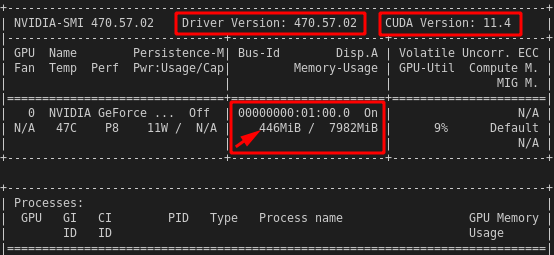

At this point, the container can see the GPU and when training, it will be utilized and you can make sure by running the same command and checking the memory utilization (pointed to with an arrow).

### Instructions to run the project

 

### Dataset analysis

To become one with the data, as the instructor recommends, I implemented the `display_instances(batch)` function and used it to display 10 images from the dataset. The shown images are different everytime and they show different streets and views of objects. This means the collected data is diverse and have good potential for producing good inference behavior. The following is a sample of the shown images. 
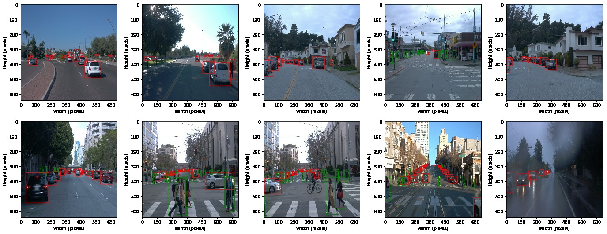

### Cross validation

Cross validation aims at estimating the performance (or accuracy) of machine learning models. The purpose of cross–validation is to test the ability of a machine learning model to predict new data. In this project, I implemented the `def split(data_dir)` function to split the data. The data is split as the course instructions. The available 100 tfrecord files are randomly divided into 70% for training, 20% for testing, and 10% for validation. 

### Training 

#### Reference experiment

**This section should detail the results of the reference experiment. It should includes training metrics and a detailed explanation of the algorithm's performances.**

The first part here was to produce the `pipeline_new.config` file as described in the course instructions. 

I made sure the GPU is utilized in the training using `nvtop` as explained by the instructor. My GPU has 8.0 GB ram and the training took a bit less than four hours. The following image indicates full resource utilization, which is great I think. Thanks for pointing out such useful tools. 

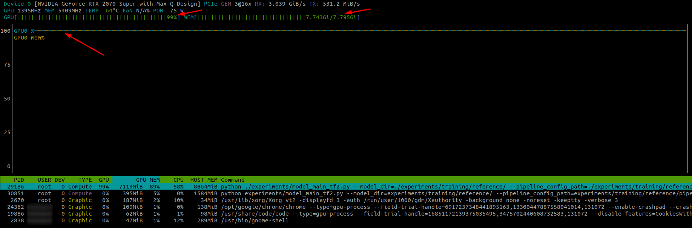

The reference training process is carried out with the generated `pipleline_new.config` file. The resulting training metrics are visualized in tensorboard are as follows

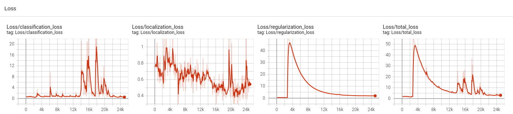

The training progesses with too many fluctiations in the losses and in the total loss. For the reference model, all losses start at high value and then decrease steadily to 0.56 classification loss, 0.54 localization loss, and 0.113 localization loss. This makes the total losses equal to 2.97. This behavior was expected, and is then adjusted in the following imrovement. It worths notinig that I changed the batch size to be 2 for the reference and improve models. The reference model uses the following augemntations by default. 

```
data_augmentation_options {
    random_horizontal_flip {
    }
  }
data_augmentation_options {
    random_crop_image {
      min_object_covered: 0.0
      min_aspect_ratio: 0.75
      max_aspect_ratio: 3.0
      min_area: 0.75
      max_area: 1.0
      overlap_thresh: 0.0
    }
  }
```

#### Improve on the reference

**This section should highlight the different strategies you adopted to improve your model. It should contain relevant figures and details of your findings.**

In this experiment, I will try to improve the model with adding augmentations as a recommended practice well-emphasized by the course instructions. I am using an edited `pipleline_imporved.config` file for this puropse. Compared to the augmentations for the reference experiment, At firrst, I thought about using the following augmentaions to try to improve the performance. I used the provided [resource](https://github.com/tensorflow/models/blob/master/research/object_detection/builders/preprocessor_builder_test.py) for augmentations tuning values.

 

```
data_augmentation_options {
    random_vertical_flip {
      keypoint_flip_permutation: 1
      keypoint_flip_permutation: 0
      keypoint_flip_permutation: 2
      keypoint_flip_permutation: 3
      keypoint_flip_permutation: 5
      keypoint_flip_permutation: 4
      probability: 0.5
    }
}

data_augmentation_options {
    random_pixel_value_scale {
      minval: 0.8
      maxval: 1.2
    }
}

data_augmentation_options {
    random_rgb_to_gray {
      probability: 0.8
    }
}

data_augmentation_options {
    random_adjust_brightness {
      max_delta: 0.2
    }
}

data_augmentation_options {
    random_adjust_contrast {
      min_delta: 0.7
      max_delta: 1.1
    }
}

data_augmentation_options {
    random_adjust_hue {
      max_delta: 0.01
    }
}

data_augmentation_options {
    random_adjust_saturation {
      min_delta: 0.75
      max_delta: 1.15
    }
}

data_augmentation_options {
    random_distort_color {
      color_ordering: 1
    }
}

data_augmentation_options {
    random_adjust_saturation {
      min_delta: 0.75
      max_delta: 1.15
    }
}

data_augmentation_options {
    random_jpeg_quality {
      random_coef: 0.5
      min_jpeg_quality: 40
      max_jpeg_quality: 90
    }
}
```

After that, I checked the augmentaion and found the following flips useless because this is not a situation that a car with encouter when enjoying healthy life. This **flipping** may be seen in an accident that flips the car. 

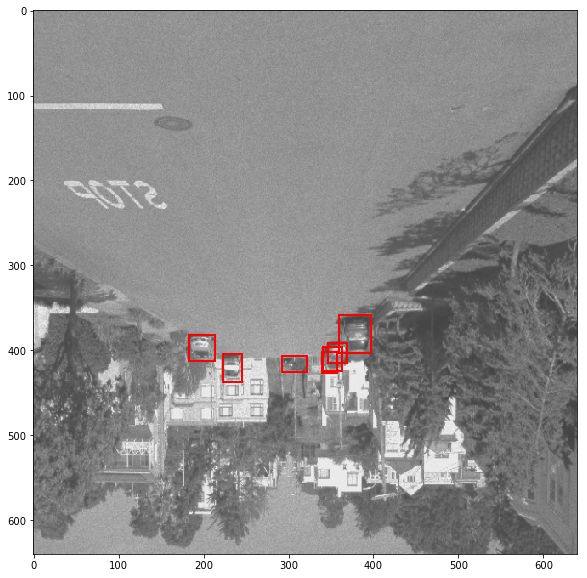

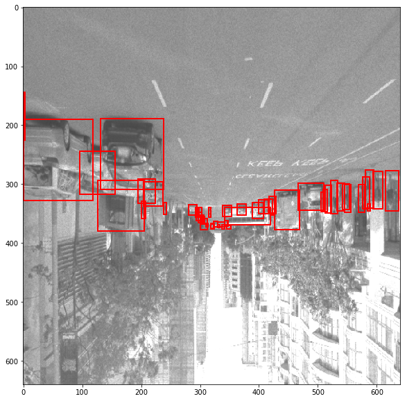

I found the **gray color** good to simulate bad weather situation (you know heavy rain that turns day into night for sometime). It was applied to many images so that I changed the probability to 0.2 instead of 0.8.

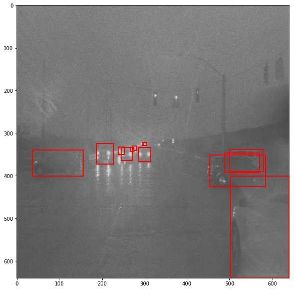

I use **brightness and hue augmentation** and found them good simulate foggy mornings as follows

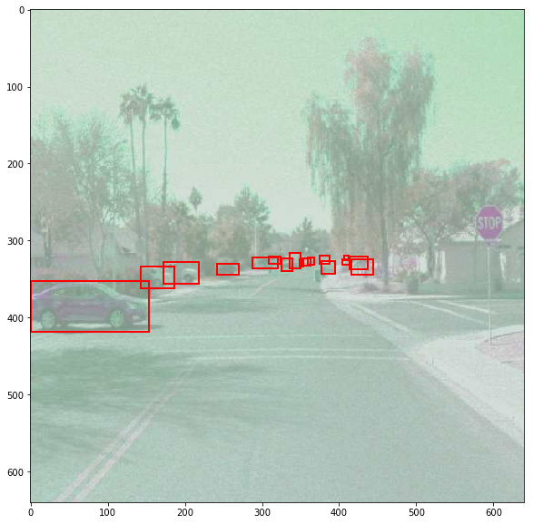

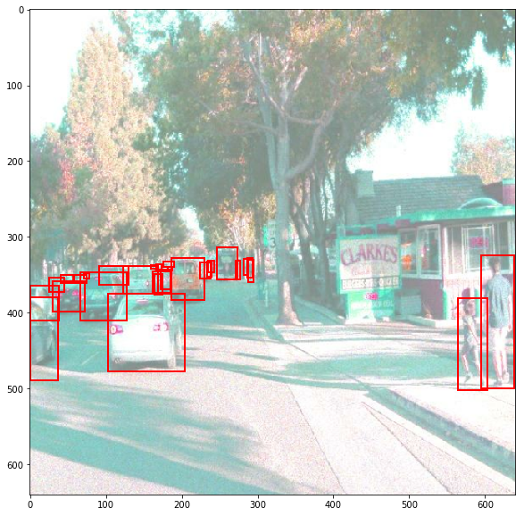

I found **changing contrast** is also good for simulating night driving 

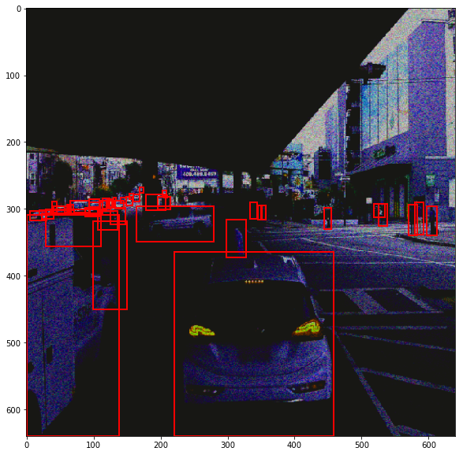

After the check, I ended up using the following augmentations. I think they are practical and do add value to the dataset. 

The resulting improvements are as follows

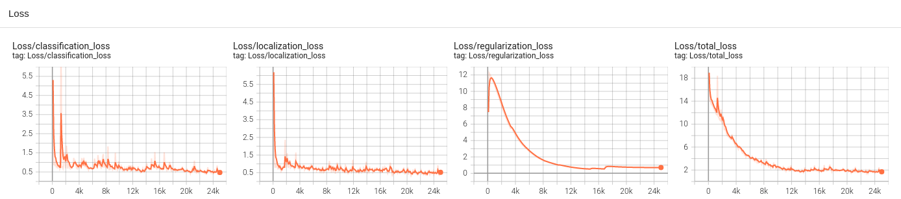

The above plot shows the imrpove training was really successful. The process progresses smoothly and ends up with decreased losses compared to the reference model. The classification loss is  0.47 localization loss is 0.54 and the regularization loss is 0.7. This total losses of the improve model is 1.67. Those decreased losses show the improved training performance corresponding to the selected augmentations. 

Lastly, I want to compare the evaluations of the reference and the improve cases. However, the reference evaluation was not simple to capture because the GPU was fully utilized, I was able to capture the fintal values of it. 

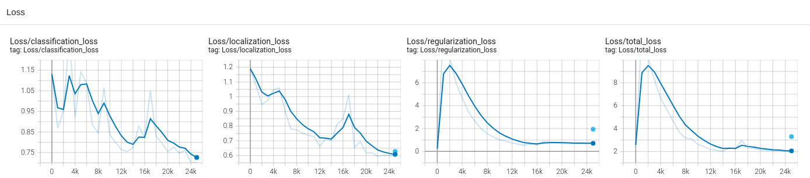

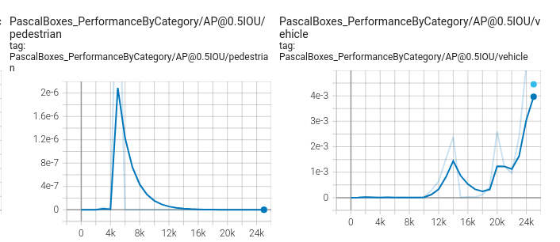

I noticed there is a very limited number of cyclists in the data, which I think should be reported. It is very important as such cyclists usually go on the road near to cars, not like pedestrians. 

I studied the distribution of the three classes on a batch of 10000 elements. The script creates the following bar chart and text. 

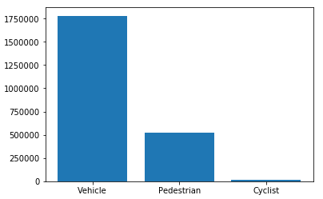

In this batch of size 100000, classes are distributed as follows:

 Vehicles are 1780245, representing 17.80245%.

 Pedestrians are 518982, representing 5.18982%.

 and Cyclists are 13431, representing 0.13431%

## Inference Video

The following is a gif video of the inference performance


The generated mp4 video file from the inference (same as above, but with different format) is [here](https://drive.google.com/file/d/1YbW5JiH9MoaTunkmw8smXGggybVXJeNd/view?usp=sharing). 
